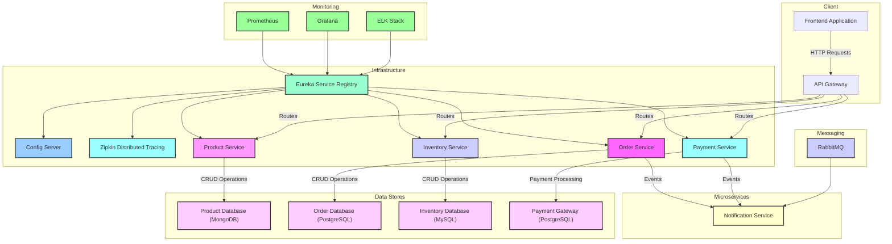
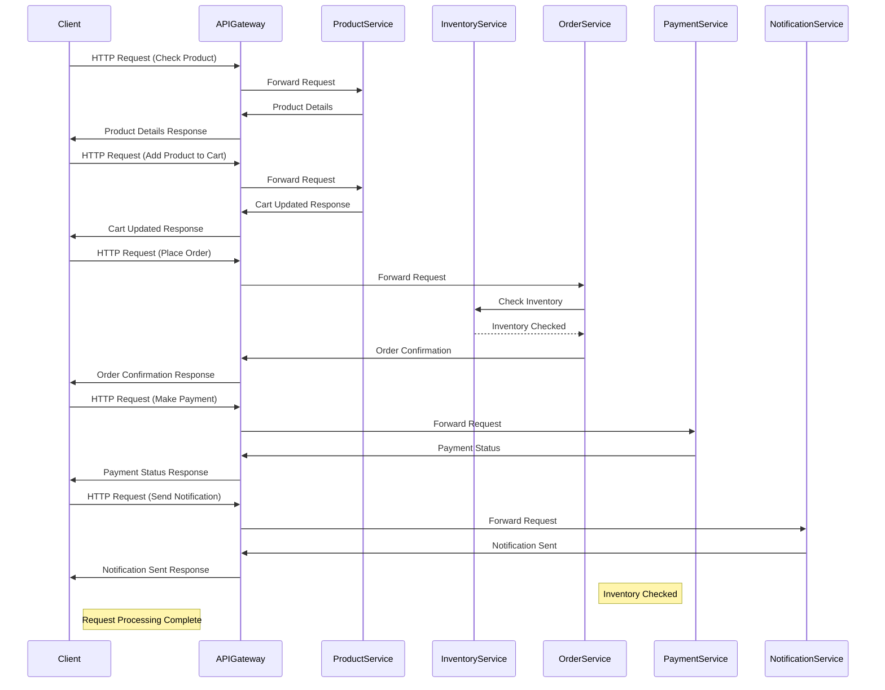

# Java Spring Boot 3 Microservices

By: John Oenga

---

---

---

## Architecture Diagram Overview

The Online Shopping Application leverages microservices architecture to provide scalability, flexibility, and maintainability. With the use of an API Gateway, centralized authentication, and distributed tracing and monitoring, the application ensures efficient request handling, security, and visibility into system performance

### Component Documentation

#### 1. API Gateway

**Description:**

- The API Gateway is a centralized entry point for all client requests.
- It routes requests to the appropriate microservices based on the request path.
- It handles authentication, rate limiting, and request validation.

---

#### 2. Eureka Service Registry

**Description:**

- The Eureka Service Registry is a service discovery mechanism provided by Spring Cloud Netflix.
- It allows microservices to register themselves with the registry upon startup.
- It enables other microservices to locate and communicate with each other.

---

#### 3. Config Server (Git/MongoDB)

**Description:**

- The Config Server is responsible for centralized configuration management.
- It retrieves configuration properties from external sources such as Git repositories or MongoDB databases.
- It provides configuration to microservices at runtime.

---

#### 4. Zipkin Distributed Tracing

**Description:**

- Zipkin is a distributed tracing system used for monitoring and debugging microservices-based architectures.
- It collects and analyzes tracing data to provide insights into the performance of requests across multiple microservices.
- It helps in identifying latency issues and optimizing service dependencies.

---

#### 5. RabbitMQ

**Description:**

- RabbitMQ is a message broker used for asynchronous communication between microservices.
- It supports message queuing, routing, and delivery between producers and consumers.
- It facilitates decoupling and scalability of microservices architecture.

---

#### 6. Prometheus

**Description:**

- Prometheus is an open-source monitoring and alerting toolkit designed for microservices architectures.
- It collects metrics from various sources, including microservices, and stores them in a time-series database.
- It provides powerful querying and visualization capabilities for monitoring system health and performance.

---

#### 7. Grafana

**Description:**

- Grafana is a visualization tool used for creating dashboards and graphs for monitoring and analytics.
- It integrates with Prometheus and other data sources to visualize metrics and performance data.
- It provides customizable dashboards for real-time monitoring and analysis of microservices.

---

#### 8. ELK Stack (Elasticsearch, Logstash, Kibana)

**Description:**

- The ELK Stack is a combination of three open-source tools: Elasticsearch, Logstash, and Kibana.
- Elasticsearch is a distributed search and analytics engine used for indexing and querying logs and other structured data.
- Logstash is a log ingestion and processing pipeline that collects, parses, and enriches log data before sending it to Elasticsearch.
- Kibana is a visualization platform that allows users to explore, visualize, and analyze data stored in Elasticsearch.

---

### Data Stores

- **Product Database (MongoDB)**: Stores product information.
- **Order Database (PostgreSQL)**: Stores order details.
- **Shopping Cart Database (MySQL)**: Stores shopping cart data.
- **Payment Gateway (PostgreSQL)**: Stores payment-related information.

---

## Service Documentation

## 1. Product Service

**API Endpoint:**

- `GET /products/{productId}` - Retrieve product details by `productId`

**Payload:**

- No payload required

**Response:**

- `200 OK`:
  - Product details in JSON format
- `404 Not Found`:
  - If the product with the specified `productId` is not found

**Description:**
The Product Service provides an API endpoint to retrieve product details based on the `productId`. It allows clients to fetch information such as product name, description, price, and availability.

---

## 2. Inventory Service

**API Endpoint:**

- `POST /inventory/check` - Check inventory availability for a product

**Payload:**

- `ProductId`: String
- `Quantity`: Integer

**Response:**

- `200 OK`:
  - Inventory availability status in JSON format
    - `Available`: Boolean
    - `Message`: String (optional)
- `400 Bad Request`:
  - If the payload is missing or invalid

**Description:**
The Inventory Service offers an API endpoint to check the availability of a product in the inventory. Clients can send a request with the `productId` and desired quantity, and the service responds with the availability status.

---

## 3. Order Service

**API Endpoint:**

- `POST /orders/place` - Place an order

**Payload:**

- `CustomerId`: String
- `Products`: Array of Product objects
  - `ProductId`: String
  - `Quantity`: Integer

**Response:**

- `201 Created`:
  - Order confirmation details in JSON format
    - `OrderId`: String
    - `TotalPrice`: Double
- `400 Bad Request`:
  - If the payload is missing or invalid

**Description:**
The Order Service exposes an API endpoint for clients to place orders. Clients provide the `customerId` and an array of `products` with their quantities. Upon successful order placement, the service responds with the order confirmation details.

---

## 4. Payment Service

**API Endpoint:**

- `POST /payments/process` - Process payment for an order

**Payload:**

- `OrderId`: String
- `TotalPrice`: Double
- `PaymentMethod`: String (e.g., "credit_card", "paypal")

**Response:**

- `200 OK`:
  - Payment status in JSON format
    - `Status`: String ("success", "failure")
    - `Message`: String (optional)
- `400 Bad Request`:
  - If the payload is missing or invalid

**Description:**
The Payment Service provides an API endpoint to process payments for orders. Clients send a request with the `orderId`, `total price`, and `payment method`. Upon successful payment processing, the service responds with the `payment status`.

---

## 5. Notification Service

**API Endpoint:**

- `POST /notifications/send` - Send notification

**Payload:**

- `Recipient`: String (email address or phone number)
- `Message`: String

**Response:**

- `200 OK`:
  - Notification status in JSON format
    - Status: String ("sent", "failed")
    - MessageId: String (optional)
- `400 Bad Request`:
  - If the payload is missing or invalid

**Description:**
The Notification Service exposes an API endpoint to send notifications to recipients. Clients provide the recipient's contact information and the message content. Upon successful notification delivery, the service responds with the notification status.

This detailed documentation outlines each service's API endpoints, payload structure, and expected responses

---

### Data Stores Documentation

#### 1. Product Database (MongoDB)

**Description:**

- The Product Database is a MongoDB database used to store product information.
- It stores details such as product name, description, price, and availability.
- Each product is uniquely identified by a productId.

---

#### 2. Order Database (PostgreSQL)

**Description:**

- The Order Database is a PostgreSQL database used to store order information.
- It stores details such as orderId, customerId, products ordered, and total price.
- Each order is uniquely identified by an orderId.

---

#### 3. Inventory Database (MySQL)

**Description:**

- The Inventory Database is a MySQL database used to store inventory information.
- It keeps track of the available quantity for each product.
- It stores data such as productId and available quantity.

---

#### 4. Payment Gateway (PostgreSQL)

**Description:**

- The Payment Gateway Database is a PostgreSQL database used to store payment transaction information.
- It records details such as orderId, payment status, and payment method.
- Each payment transaction is uniquely identified by an orderId.

---

### Request Flow Documentation

#### 1. Product Service Request

**Request Flow:**

1. The Client sends an HTTP request to the API Gateway to retrieve product details.
2. The API Gateway forwards the request to the Product Service.
3. The Product Service retrieves product details from the Product Database (MongoDB) based on the productId.
4. The Product Service sends the product details response back to the API Gateway.
5. The API Gateway forwards the product details response to the Client.

---

#### 2. Order Service

**Request Flow:**

1. The Client sends an HTTP request to the API Gateway to place an order.
2. The API Gateway forwards the request to the Order Service.
3. The Order Service validates the order payload and extracts order details.
4. The Order Service checks product availability by communicating with the Inventory Service.
5. If products are available, the Order Service stores the order details in the Order Database (PostgreSQL).
6. The Order Service sends the order confirmation response back to the API Gateway.
7. The API Gateway forwards the order confirmation response to the Client.

---

#### 3. Inventory Service

**Request Flow:**

1. The Order Service sends an HTTP request to the Inventory Service to check product availability.
2. The Inventory Service validates the request payload and extracts product and quantity details.
3. The Inventory Service queries the Inventory Database (MySQL) to check the available quantity for the product.
4. The Inventory Service determines if the product is available based on the available quantity.
5. The Inventory Service sends the inventory availability status response back to the Order Service.

---

#### 4. Payment Service Request

**Request Flow:**

1. The Client sends an HTTP request to the API Gateway to make a payment.
2. The API Gateway forwards the request to the Payment Service.
3. The Payment Service validates the payment payload and extracts payment details.
4. The Payment Service processes the payment transaction using the Payment Gateway (PostgreSQL).
5. The Payment Service sends the payment status response back to the API Gateway.
6. The API Gateway forwards the payment status response to the Client.

---

#### 5. Notification Service Request

**Request Flow:**

1. The Client sends an HTTP request to the API Gateway to send a notification.
2. The API Gateway forwards the request to the Notification Service.
3. The Notification Service validates the notification payload and extracts recipient and message details.
4. The Notification Service sends the notification message to the recipient using an external notification provider.
5. The Notification Service sends the notification status response back to the API Gateway.
6. The API Gateway forwards the notification status response to the Client.

---
